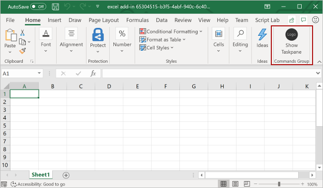

orial Docs
https://learn.microsoft.com/en-us/office/dev/add-ins/tutorials/word-tutorial

## Prerequisites

[NodeJS](https://nodejs.org/en) (The lastest version)

The lastest version of [Yeoman](https://github.com/yeoman/yo) and the [Yeoman generator for Office Add-ins](https://learn.microsoft.com/en-us/office/dev/add-ins/develop/yeoman-generator-overview)

Install these tool globally:

```
sudo npm install -g yo generator-office
```

Init the project:

```
yo office
```

Choose the templates (As guided)

- Choose a project type: `Office Add-in Task Pane project`
- Choose a script type: `JavaScript`
- What do you want to name your add-in? `tutorial-excel-addin`
- Which Office client application would you like to support? `Excel`
  <br />
  

Install office-addin-debugging:

```
npm install office-addin-debugging
```

## How to run the project

If you're testing your add-in on Mac, run the following command before proceeding. When you run this command, the local web server starts.

```
npm run dev-server
```

- To test your add-in in Excel, run the following command in the root directory of your project. This starts the local web server (if it's not already running) and opens Excel with your add-in loaded.

- Open another terminal -> start the localhost/3000:

  ```
  npm start
  ```

- To test your add-in in Excel on a browser, run the following command in the root directory of your project. When you run this command, the local web server starts. Replace `{url}` with the URL of a Excel document on your OneDrive or a SharePoint library to which you have permissions.
  ```
  npm run start:web -- --document {url}
  ```

In Excel, choose the `Home` tab, and then choose the `Show Taskpane` button in the ribbon to open the add-in task pane.
<br />


