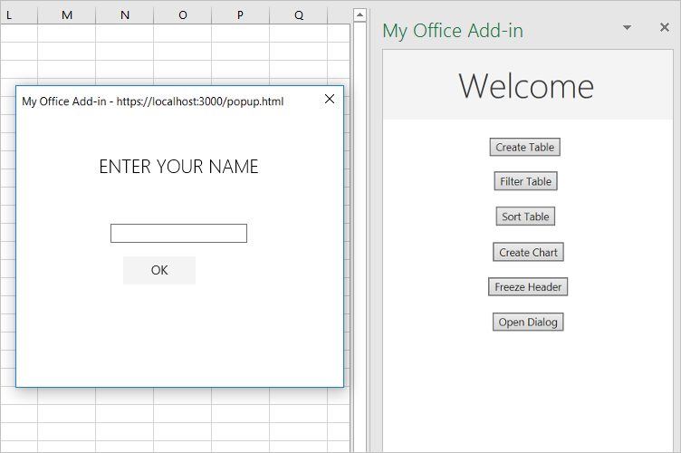

## Test the Add-in

1. If the local web server is already running and your add-in is already loaded in Excel, proceed to step 2. Otherwise, start the local web server and sideload your add-in. (See [How to run the project](./how-to-run-the-project.md))

2. In the task pane, choose the `Create Table` button.


3. Choose the `Filter Table` button and the `Sort Table` button, in either order.


4. Choose the `Create Chart` button. A chart is created and only the data from the rows that have been filtered are included. The labels on the data points across the bottom are in the sort order of the chart; that is, merchant names in reverse alphabetical order.


---

5. Delete all the table (to start testing the next function)

6. In the task pane, choose the `Create Table` button.

7. In the task pane, choose the `Freeze Header` button.

8. Scroll down the worksheet far enough to see that the table header remains visible at the top even when the higher rows scroll out of sight.

---

9. For the next step: Close all Office applications, including Excel (or close the browser tab if you're using Excel on the web).

10. Clear the Office cache. This is necessary to completely clear the old version of the add-in from the client application. Instructions for this process are in the article [Clear the Office cache](https://learn.microsoft.com/en-us/office/dev/add-ins/testing/clear-cache).

11. If the local web server is already running, stop it by entering the following command in the command prompt. This should close the node command window.

```
npm stop
```

12. Because your manifest file has been updated, you must sideload your add-in again, using the updated manifest file. Start the local web server and sideload your add-in.

    1. To test your add-in in Excel, run the following command in the root directory of your project.

    ```
    npm start
    ```

13. On the `Home` tab in Excel, choose the `Toggle Worksheet Protection` button. Note that most of the controls on the ribbon are disabled (and visually grayed-out) as seen in the following screenshot.
    

14. Select a cell and try to edit its content. Excel displays an error message indicating that the worksheet is protected.

15. Choose the `Toggle Worksheet Protection` button again, and the controls are reenabled, and you can change cell values again.

16. Delete all the result from the Excel

17. Choose the `Open Dialog` button in the task pane.

18. While the dialog is open, drag it and resize it. Note that you can interact with the worksheet and press other buttons on the task pane, but you cannot launch a second dialog from the same task pane page.

19. In the dialog, enter a name and choose the `OK` button. The name appears on the task pane and the dialog closes.

20. Optionally, in the `./src/taskpane/taskpane.js` file, comment out the line `dialog.close();` in the `processMessage` function. Then repeat the steps of this section. The dialog stays open and you can change the name. You can close it manually by pressing the X button in the upper right corner.


